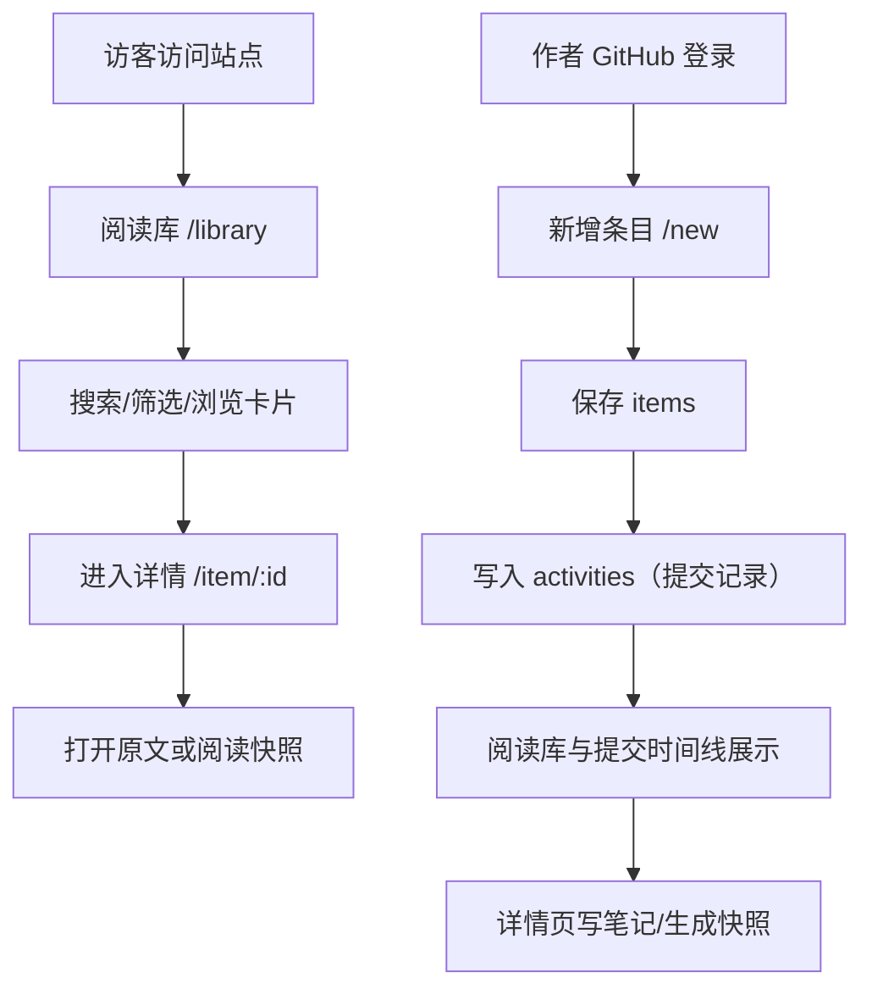

## 1. 产品概述
一个用于记录个人博客与论文阅读、集中管理阅读入口、沉淀笔记与快照的个人网站；对外默认公开浏览，对内通过 GitHub 登录完成新增与编辑。

- 解决的问题：链接分散、阅读入口不统一、阅读记录难以回溯、笔记难以检索与复盘
- 目标用户：以“个人”为主（单作者），面向公众展示阅读清单与 commit 式阅读增量
- 产品价值：像 GitHub 一样用清晰的提交日志记录知识输入；像阅读应用一样提供舒适的阅读与整理体验

## 2. 核心功能

### 2.1 用户角色
| 角色 | 登录方式 | 核心权限 |
|------|----------|----------|
| 访客 | 无 | 浏览公开阅读库、公开 Commit 时间线、打开原文 |
| 作者 | GitHub 登录 | 新增/编辑/删除条目、写笔记、生成快照、管理可见性 |

### 2.2 功能模块
1. **阅读库（Library）**：单列卡片列表、搜索与筛选、公开浏览
2. **提交记录（Commits）**：按天聚合的增量日志（commit 风格），公开浏览
3. **新增条目（New）**：作者登录后新增 blog/paper 链接并生成一次“提交”
4. **阅读详情（Item）**：原文入口 + 快照阅读 + 笔记（作者可编辑）
5. **设置（Settings）**：主题切换、个人信息与基础配置（后续）

### 2.3 页面明细
| 页面名称 | 模块名称 | 功能描述 |
|----------|----------|----------|
| /library | 顶部搜索 | 标题/来源/标签搜索（MVP：标题与来源；增强：全文） |
| /library | 筛选器 | 类型（Blog/Paper）、状态（Unread/Reading/Done）、标签、时间范围 |
| /library | 单列卡片流 | 标题、来源、日期、标签、状态；点击进入详情 |
| /commits | 按天分组 | 按日期分组展示活动记录；支持搜索与跳转条目 |
| /commits | Commit 行 | 文案模板：`Paper: 标题` / `Blog: 标题`；显示时间与类型徽标 |
| /new | 新增表单 | URL、类型、标签、状态、可见性（默认 public）、可选备注 |
| /item/[id] | 顶栏 | 标题、标签、状态、可见性、打开原文按钮 |
| /item/[id] | 阅读区 | 快照渲染（无快照时提示并提供抓取按钮） |
| /item/[id] | 笔记区 | Markdown 笔记编辑与预览（作者可写，访客默认不展示） |

## 3. 核心流程

### 3.1 主要用户流
- 访客：进入 /library 浏览 → 搜索/筛选 → 点击条目 → 打开原文或阅读快照
- 作者：GitHub 登录 → /new 新增链接 → 自动生成一次 commit → 出现在 /commits 与 /library → 在详情页写笔记/生成快照

### 3.2 流程图

## 4. 用户界面设计

### 4.1 设计风格
- 方向：阅读应用风格（高留白、弱边框、舒适排版）
- 主题：亮色/暗色切换；支持跟随系统与手动覆盖
- 布局：侧边栏导航 + 顶部搜索；列表为单列卡片
- 卡片：圆角、轻阴影、信息层级清晰；不强依赖缩略图（默认无）
- 字体：标题偏书刊感展示字体 + 正文高可读字体（实现阶段确定具体字体方案）

### 4.2 页面设计概览
| 页面名称 | 模块名称 | UI 元素 |
|----------|----------|----------|
| /library | 单列卡片 | 标题（主）、来源与日期（辅）、标签 chips、状态 pill、点击态/悬停态 |
| /commits | 时间线 | 日期标题、提交行列表、类型徽标、跳转链接、轻分隔线 |
| /item/[id] | 阅读+笔记 | 主阅读区为主体，笔记区右侧窄栏；阅读区支持长文舒适行宽 |
| 全局 | 主题与导航 | 侧边栏图标导航、主题切换按钮、登录入口（作者） |

### 4.3 响应式
- 桌面优先；移动端适配：侧边栏折叠为底部导航或抽屉；详情页笔记区可折叠

