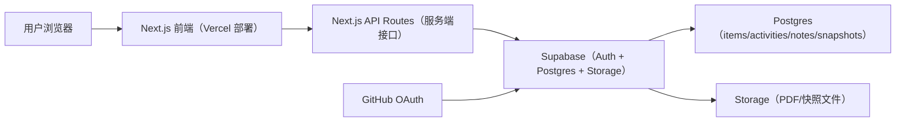
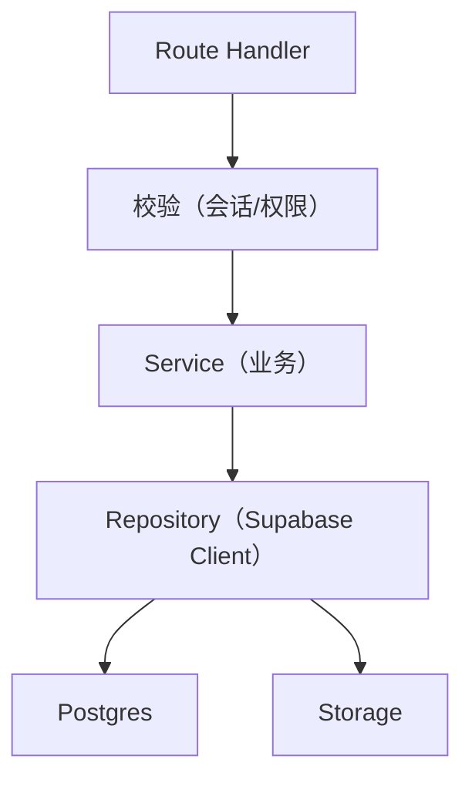
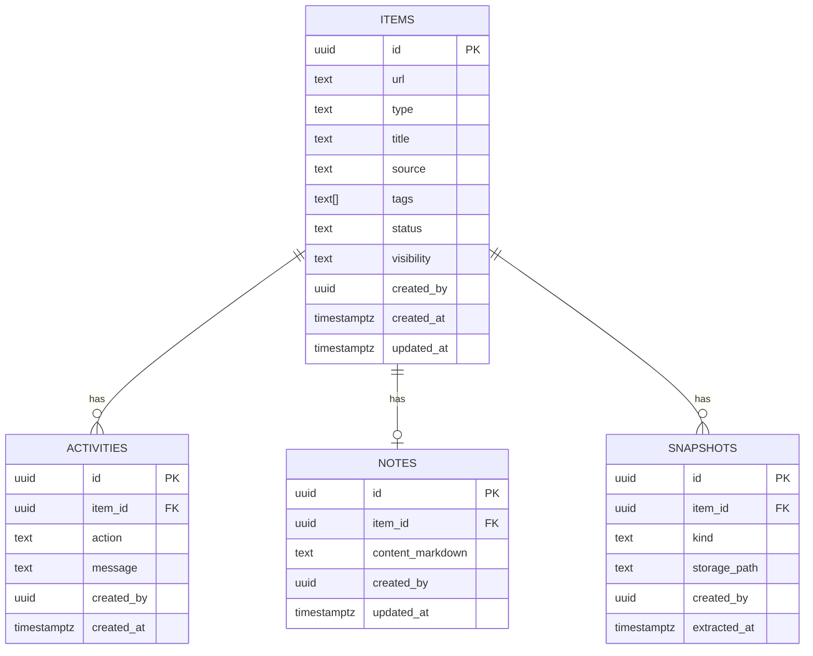

## 1. 架构设计


## 2. 技术说明
- 前端：Next.js（App Router）+ TypeScript + Tailwind CSS
- 初始化工具：create-next-app
- 后端：Next.js API Routes（用于抓取网页快照、写入数据、权限校验）
- 数据库：Supabase Postgres（RLS 控制公开读与作者写）
- 认证：Supabase Auth（GitHub 登录）
- 存储：Supabase Storage（网页快照 HTML/Markdown、PDF）

## 3. 路由定义
| 路由 | 目的 |
|------|------|
| /library | 公开阅读库（单列卡片、搜索/筛选） |
| /commits | 公开提交时间线（按天聚合） |
| /new | 作者新增条目（登录后） |
| /item/[id] | 条目详情（原文/快照/笔记） |
| /login | 登录入口（GitHub OAuth） |

## 4. API 定义
### 4.1 类型定义（概念）
```ts
export type ItemType = "blog" | "paper"
export type ItemStatus = "unread" | "reading" | "done"
export type Visibility = "public" | "private"

export type Item = {
  id: string
  url: string
  type: ItemType
  title: string | null
  source: string | null
  tags: string[]
  status: ItemStatus
  visibility: Visibility
  createdAt: string
}

export type Activity = {
  id: string
  itemId: string
  action: "add" | "update" | "note" | "snapshot"
  message: string
  createdAt: string
}
```

### 4.2 接口列表
| 方法 | 路径 | 目的 |
|------|------|------|
| POST | /api/items | 新增条目并写入一条 activities（提交记录） |
| PATCH | /api/items/:id | 更新条目（状态/标签/可见性等），可选写入 activities |
| POST | /api/items/:id/snapshot | 抓取网页并写入 Storage，记录 snapshots 与 activities |
| PUT | /api/items/:id/note | 更新笔记内容（notes） |

## 5. 服务端架构图


## 6. 数据模型
### 6.1 ER 图


### 6.2 DDL（建议）
- 表结构与 RLS 策略采用 Supabase SQL Editor 执行（默认公开读；作者写入）
- items 对 url 设置唯一索引，防重复录入
- tags 用 GIN 索引支持筛选
- activities 按 created_at 倒序索引支撑时间线

